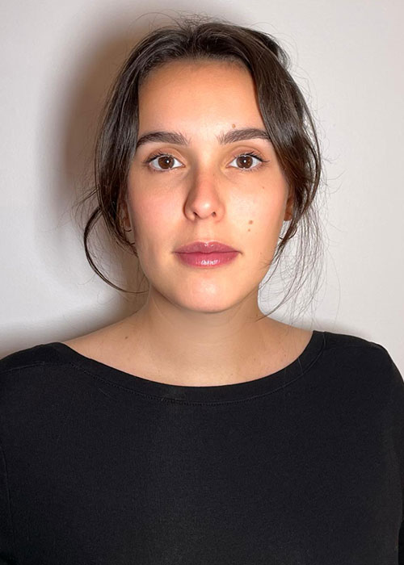
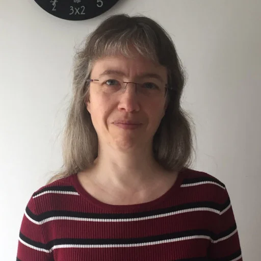
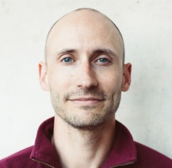
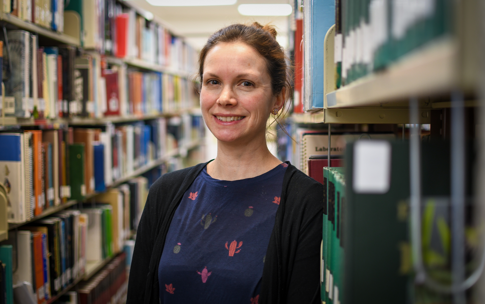
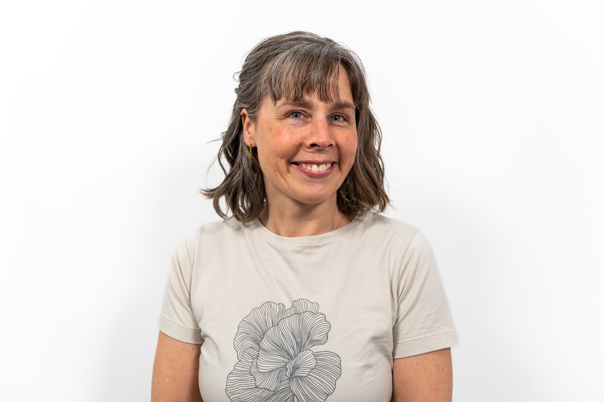
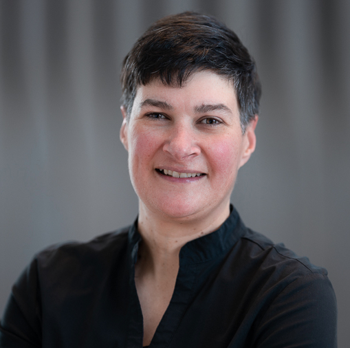
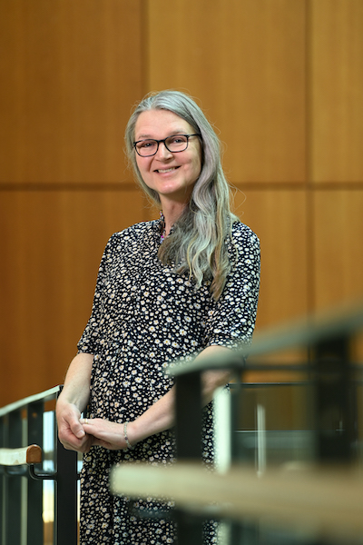
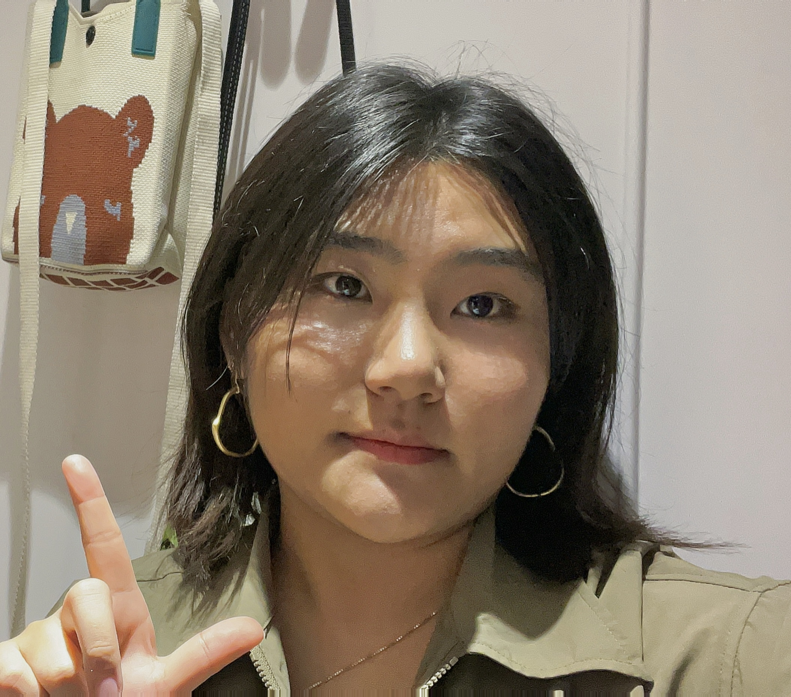

# Meet the team

<table>

<!-- Isabelle Arseneau -->

<tr><td style="height:"10px"> </td></tr>
  <tr>
    <td style="width:20%;vertical-align: top;">{width="150px"}</td>
    <td style="width:15px"></td>
    <td style="width:80%;vertical-align: top;"> 
      **Isabelle Arseneau**  
      Professeure  
      Unité départementale des sciences de l'éducation 
      Université du Québec à Rimouski	  
  

  

    </td>
  </tr>

<!-- Stephen  Brooks -->

<tr><td style="height:"10px"> </td></tr>
  <tr>
    <td style="width:20%;vertical-align: top;">{width="150px"}</td>
    <td style="width:15px"></td>
    <td style="width:80%;vertical-align: top;"> 
      **Stephen Brooks**  
      Professor  
      Faculty of Computer Science 
      Dalhousie University
  

  

  <a href="https://web.cs.dal.ca/~sbrooks/" target="_blank" style="text-decoration: none;">
    <i class="fa-solid fa-globe" style="font-size: 24px; color: #0077b5;"></i>
  </a>

    </td>
  </tr>

<!-- Camille Bordet  -->
<tr><td style="height:"10px"> </td></tr>
  <tr>
    <td style="width:20%;vertical-align: top;">{width="150px"}</td>
    <td style="width:15px"></td>
    <td style="width:80%;vertical-align: top;"> 
      **Camille Bordet**  
      Étudiante au doctorat   
 	  Unité départementale des sciences de l'éducation 
      Université du Québec à Rimouski
  

  

    </td>
  </tr>
  

  
<!-- Caroline Damboise  -->
<tr><td style="height:"10px"> </td></tr>
  <tr>
    <td style="width:20%;vertical-align: top;">{width="150px"}</td>
    <td style="width:15px"></td>
    <td style="width:80%;vertical-align: top;"> 
      **Caroline Damboise**  
      Professeure  
      Unité départementale des sciences de l'éducation 
      Université du Québec à Rimouski	  
  

  

    </td>
  </tr>
  
<!-- Anne Fauré  -->
<tr><td style="height:"10px"> </td></tr>
  <tr>
    <td style="width:20%;vertical-align: top;">{width="150px"}</td>
    <td style="width:15px"></td>
    <td style="width:80%;vertical-align: top;"> 
      **Anne Fauré**  
      Professeure  
	    Unité départementale des sciences de la gestion  
      Université du Québec à Rimouski	  	    
  

  

    </td>
  </tr>

<!-- Geoff Krause  -->
<tr><td style="height:"10px"> </td></tr>
  <tr>
    <td style="width:20%;vertical-align: top;">{width="150px"}</td>
    <td style="width:15px"></td>
    <td style="width:80%;vertical-align: top;"> 
      **Geoff Krause**  
      Ph.D. Candidate  
	  Department of Information Science  
	  Dalhousie University  
  

  

  

<!-- Alexandre Legault  -->
<tr><td style="height:"10px"> </td></tr>
  <tr>
    <td style="width:20%;vertical-align: top;">{width="150px"}</td>
    <td style="width:15px"></td>
    <td style="width:80%;vertical-align: top;"> 
      **Alexandre Legault**  
      Masters Student  
	    Department of Information Science  
	    Dalhousie University
  

  

    </td>
  </tr>
  

  
<!-- Bertrum MacDonald  -->
<tr><td style="height:"10px"> </td></tr>
  <tr>
    <td style="width:20%;vertical-align: top;">{width="150px"}</td>
    <td style="width:15px"></td>
    <td style="width:80%;vertical-align: top;"> 
      **Bertrum MacDonald**  
      Professor Emeritus 
	  Department Information Science  
	  Dalhousie University 
  

  

    </td>
  </tr>

<!-- Joseph Malloch -->

<tr><td style="height:"10px"> </td></tr>
  <tr>
    <td style="width:20%;vertical-align: top;">{width="150px"}</td>
    <td style="width:15px"></td>
    <td style="width:80%;vertical-align: top;"> 
      **Joseph Malloch**  
      Associate Professor  
      Faculty of Computer Science 
      Dalhousie University
  

  

  <a href="https://josephmalloch.wordpress.com/" target="_blank" style="text-decoration: none;">
    <i class="fa-solid fa-globe" style="font-size: 24px; color: #0077b5;"></i>
  </a>

    </td>
  </tr>

<!-- Kerri McPherson  -->
<tr><td style="height:"10px"> </td></tr>
  <tr>
    <td style="width:20%;vertical-align: top;">{width="150px"}</td>
    <td style="width:15px"></td>
    <td style="width:80%;vertical-align: top;"> 
      **Kerri McPherson**  
      Science consultant 
	  Department of Education and Early Childhood Development 
      Nova Scotia
  

  

    </td>
  </tr>
  
<!-- Philippe Mongeon -->
<tr><td style="height:"10px"> </td></tr>
  <tr>
    <td style="width:20%;vertical-align: top;">{width="150px"}</td>
    <td style="width:15px"></td>
    <td style="width:80%;vertical-align: top;"> 
      **Philippe Mongeon**  
      Associate professor  
      Department of Information Science 
      Dalhousie University
  

  

  <a href="https://pmongeon.github.io" target="_blank" style="text-decoration: none;">
    <i class="fa-solid fa-globe" style="font-size: 24px; color: #0077b5;"></i>
  </a>
  <a href="https://www.linkedin.com/in/philippe-mongeon/" target="_blank" style="text-decoration: none;">
    <i class="fab fa-linkedin" style="font-size: 24px; color: #0077b5;"></i>
  </a>
  <a href="https://orcid.org/0000-0003-1021-059X" target="_blank" style="text-decoration: none;">
    <i class="fab fa-orcid" style="font-size: 24px; color: #0077b5;"></i>
  </a>

    </td>
  </tr>
  
<!-- Émilie Morin  -->
<tr><td style="height: 10px"> </td></tr>
<tr>
  <td style="width:20%;vertical-align: top;">{width="150px"}</td>
  <td style="width:15px"></td>
  <td style="width:80%;vertical-align: top;"> 
    **Émilie Morin**  
    Professeure  
    Unité départementale des sciences de l'éducation 
    Université du Québec à Rimouski
    

    

      <a href="https://www.uqar.ca/professeurs/morin-emilie/" target="_blank" style="text-decoration: none;">
        <i class="fa-solid fa-globe" style="font-size: 24px; color: #0077b5;"></i>
      </a>
      <a href="https://www.linkedin.com/in/%C3%A9milie-morin-3256a4a9/" target="_blank" style="text-decoration: none;">
        <i class="fab fa-linkedin" style="font-size: 24px; color: #0077b5;"></i>
      </a>
      <a href="https://www.researchgate.net/profile/Emilie-Morin-2?ev=hdr_xprf" target="_blank" style="text-decoration: none;">
        <i class="fab fa-researchgate" style="font-size: 24px; color: #0077b5;"></i>
      </a>
      <a href="https://orcid.org/0000-0002-6293-0460" target="_blank" style="text-decoration: none;">
        <i class="fab fa-orcid" style="font-size: 24px; color: #0077b5;"></i>
      </a>
    

  </td>
</tr>

  
<!-- Colin Orian -->

<tr><td style="height:"10px"> </td></tr>
  <tr>
    <td style="width:20%;vertical-align: top;">{width="150px"}</td>
    <td style="width:15px"></td>
    <td style="width:80%;vertical-align: top;"> 
      **Colin Orian**  
      Ph.D. Student  
      Faculty of Computer Science 
      Dalhousie University
  

  

  

  <a href="https://github.com/Colin-Orian" target="_blank" style="text-decoration: none;">
    <i class="fab fa-githhub" style="font-size: 24px; color: #0077b5;"></i>
  </a>
    <a href="https://www.researchgate.net/profile/Colin-Orian" target="_blank" style="text-decoration: none;">
    <i class="fab fa-researchgate" style="font-size: 24px; color: #0077b5;"></i>
  </a>
  <a href="https://orcid.org/0000-0002-5013-4387" target="_blank" style="text-decoration: none;">
    <i class="fab fa-orcid" style="font-size: 24px; color: #0077b5;"></i>
  </a>
  <a href="https://www.linkedin.com/in/colin-orian-a22a4a155" target="_blank" style="text-decoration: none;">
    <i class="fab fa-linkedin" style="font-size: 24px; color: #0077b5;"></i>
  </a>

    </td>
  </tr>

<!-- Marie-Hélène Ouellet D'Amours  -->
<tr><td style="height:"10px"> </td></tr>
  <tr>
    <td style="width:20%;vertical-align: top;">{width="150px"}</td>
    <td style="width:15px"></td>
    <td style="width:80%;vertical-align: top;"> 
      **Marie-Hélène Ouellet D'Amours**  
      Coordonnatrice de projets de recherche  
	  Unité départementale des sciences de l'éducation 
      Université du Québec à Rimouski
  

  

    </td>
  </tr>
  
  
<!-- Kristin Poduska  -->
<tr><td style="height:"10px"> </td></tr>
  <tr>
    <td style="width:20%;vertical-align: top;">{width="150px"}</td>
    <td style="width:15px"></td>
    <td style="width:80%;vertical-align: top;"> 
      **Kristin Poduska**  
      Professor  
	  Department of Physics & Physical Oceanography  
	  Memorial University 
  

  

  <a href="https://kpoduska.github.io/PoduskaLab/" target="_blank" style="text-decoration: none;">
    <i class="fa-solid fa-globe" style="font-size: 24px; color: #0077b5;"></i>
  </a>
  <a href="https://www.linkedin.com/in/poduska/" target="_blank" style="text-decoration: none;">
    <i class="fab fa-linkedin" style="font-size: 24px; color: #0077b5;"></i>
  </a>
  <a href="https://orcid.org/0000-0003-4495-0668" target="_blank" style="text-decoration: none;">
    <i class="fab fa-orcid" style="font-size: 24px; color: #0077b5;"></i>
  </a>

<!-- Derek Reilly  -->
<tr><td style="height:"10px"> </td></tr>
  <tr>
    <td style="width:20%;vertical-align: top;">{width="150px"}</td>
    <td style="width:15px"></td>
    <td style="width:80%;vertical-align: top;"> 
      **Derek Reilly**  
      Professor  
	  Faculty of Computer Science  
	  Dalhousie University 
  

  

    </td>
  </tr>

<!-- Poppy Riddle  -->
<tr><td style="height:"10px"> </td></tr>
  <tr>
    <td style="width:20%;vertical-align: top;">{width="150px"}</td>
    <td style="width:15px"></td>
    <td style="width:80%;vertical-align: top;"> 
      **Popy Riddle**  
      Ph.D. Candidate  
	  Department of Information Science  
	  Dalhousie University
  

  

    </td>
  </tr>

<!-- Geneviève Therriault -->

<tr><td style="height:"10px"> </td></tr>
  <tr>
    <td style="width:20%;vertical-align: top;">{width="150px"}</td>
    <td style="width:15px"></td>
    <td style="width:80%;vertical-align: top;"> 
      **Geneviève Therriault**  
      Professeure  
      Unité départementale des sciences de l'éducation 
      Université du Québec à Rimouski
  

  

  <a href="https://www.uqar.ca/recherche/unites-de-recherche/chaire-en-education-a-lenvironnement-et-au-developpement-durable-uqar-desjardins/" target="_blank" style="text-decoration: none;">
    <i class="fa-solid fa-globe" style="font-size: 24px; color: #0077b5;"></i>
  </a>  
  <a href="https://www.facebook.com/ChaireEEDD" target="_blank" style="text-decoration: none;">
    <i class="fab fa-facebook" style="font-size: 24px; color: #0077b5;"></i>
  </a>
  <a href="https://www.instagram.com/chaire_eedd_uqar/" target="_blank" style="text-decoration: none;">
    <i class="fab fa-instagram" style="font-size: 24px; color: #0077b5;"></i>
  </a>

    </td>
  </tr>
  

<!-- Rémi Toupin -->

  <tr><td style="height:"10px"> </td></tr>
  <tr>
    <td style="width:20%;vertical-align: top;">{width="150px"}</td>
    <td style="width:15px"></td>
    <td style="width:80%;vertical-align: top;"> 
      **Rémi Toupin**  
      Postdoctoral Fellow  
      Department of Information Science 
      Dalhousie University
  

  

  <a href="https://www.linkedin.com/in/remi-toupin-897405a0/" target="_blank" style="text-decoration: none;">
    <i class="fab fa-linkedin" style="font-size: 24px; color: #0077b5;"></i>
  </a>
  <a href="https://orcid.org/0000-0001-6765-0380" target="_blank" style="text-decoration: none;">
    <i class="fab fa-orcid" style="font-size: 24px; color: #0077b5;"></i>
  </a>

    </td>
  </tr>
  
<!-- Sandra Toze  -->
<tr><td style="height:"10px"> </td></tr>
  <tr>
    <td style="width:20%;vertical-align: top;">{width="150px"}</td>
    <td style="width:15px"></td>
    <td style="width:80%;vertical-align: top;"> 
      **Sandra Toze**  
      Associate Professor  
	  Department of Information Science  
	  Dalhousie University	
  

  

    </td>
  </tr>
  
<!-- Jérôme Train  -->
<tr><td style="height:"10px"> </td></tr>
  <tr>
    <td style="width:20%;vertical-align: top;">{width="150px"}</td>
    <td style="width:15px"></td>
    <td style="width:80%;vertical-align: top;"> 
      **Jérôme Train**  
      Étudiant au doctorat   
	  Centre de recherche interuniversitaire sur la formation et la profession enseignante 
      Université du Québec en Outaouais
  

  

    </td>
  </tr>
  
<!-- Rina Wehbe  -->
<tr><td style="height:"10px"> </td></tr>
  <tr>
    <td style="width:20%;vertical-align: top;">{width="150px"}</td>
    <td style="width:15px"></td>
    <td style="width:80%;vertical-align: top;"> 
      **Rina Wehbe**  
      Assistant Professor  
	  Faculty of Computer Science  
	  Dalhousie University
  

  

    </td>
  </tr>

<!-- Levy Zhong -->

<tr><td style="height:"10px"> </td></tr>
  <tr>
    <td style="width:20%;vertical-align: top;">{width="150px"}</td>
    <td style="width:15px"></td>
    <td style="width:80%;vertical-align: top;"> 
      **Zaiyang Zhong (Levy)**  
      Ph.D. Student  
      Faculty of Computer Science 
      Dalhousie University
  

  

  <a href="https://www.linkedin.com/in/zaiyang-zhong-38443b1b9/" target="_blank" style="text-decoration: none;">
    <i class="fab fa-linkedin" style="font-size: 24px; color: #0077b5;"></i>
  </a>

    </td>
  </tr>  

  
</table>
